# 🧠 Resolvendo Códigos em Python com o GitHub Copilot

Olá! 👋 Neste repositório, você encontrará resoluções de problemas simples usando Python com o apoio do **GitHub Copilot** e/ou **ChatGPT**.  
O foco é aplicar conceitos fundamentais de programação e explorar o uso de IA para sugerir e melhorar código.

---

## 1 - Concatenando Dados 🐾

### 📌 Descrição

Vamos receber dois dados diferentes do usuário e concatená-los em uma única string.

### 💬 Prompt no ChatGPT

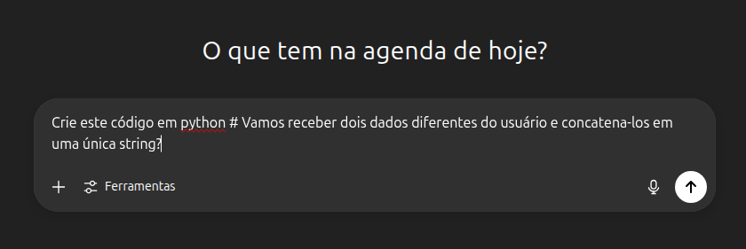

### 🧠 Código Gerado

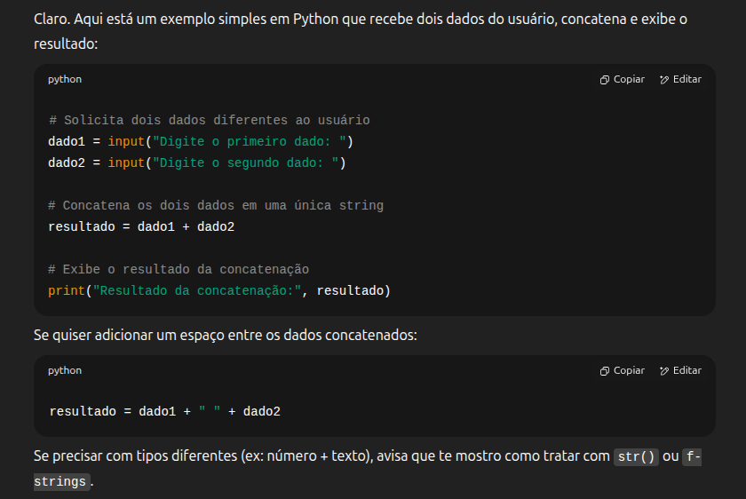

### 🖥️ Terminal com Código Funcionando

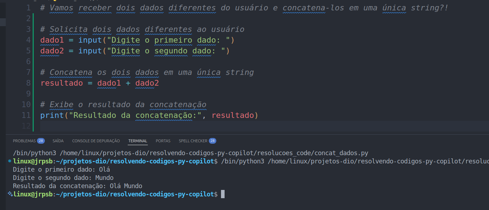

### 📚 O que aprenderemos?

* Manipulação de Strings
* Concatenação com `+`
* Entrada de dados com `input()`
* Sugestões do GitHub Copilot

---

## 2 - Repetindo Textos ✏️

### 📌 Descrição

Solicite uma **string** e um **número inteiro** como entrada. Depois, retorne a string repetida o número de vezes informado, separada por **traços** (`-`).

### 💬 Prompt no ChatGPT


### 🧠 Código Gerado

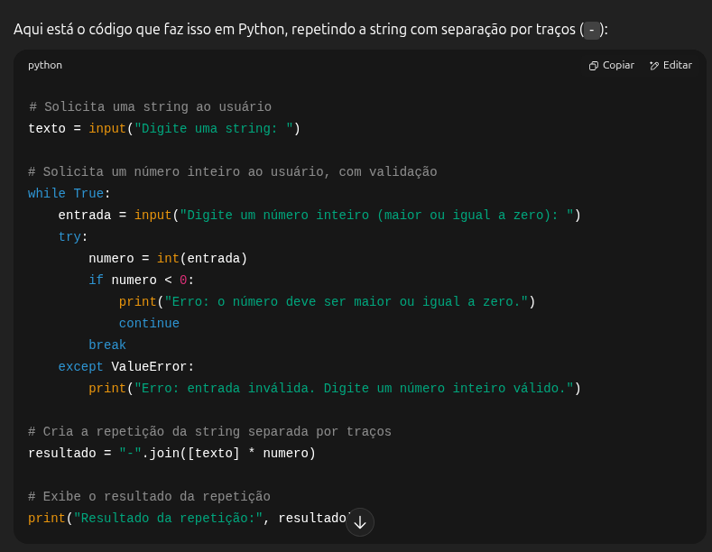

### 🖥️ Terminal com Código Funcionando

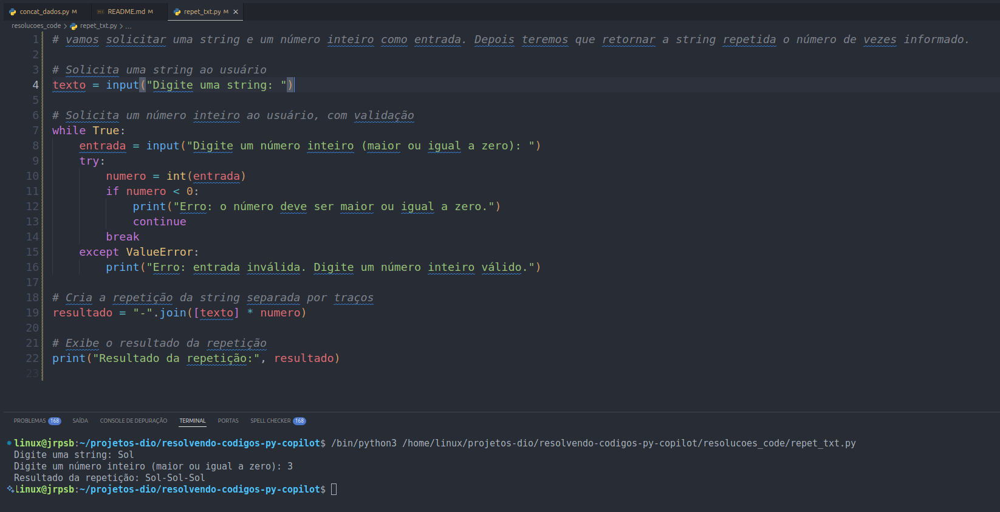

### 📚 O que aprenderemos?

* Manipulação de Strings (`str`)
* Números Inteiros (`int`)
* Repetição com `join()`
* Entrada de dados
* Sugestões do GitHub Copilot

---

## 3 - Operações Matemáticas Simples 📐

### 📌 Descrição

Solicite dois números e a operação desejada (+, -, *, /), e realize o cálculo de acordo com a escolha.

### 💬 Prompt no ChatGPT


### 🧠 Código Gerado

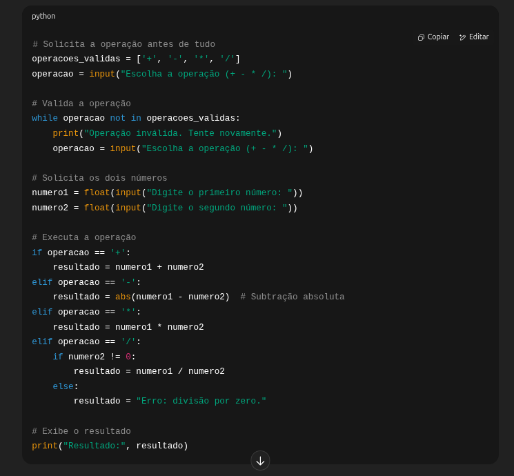

### 🖥️ Terminal com Código Funcionando

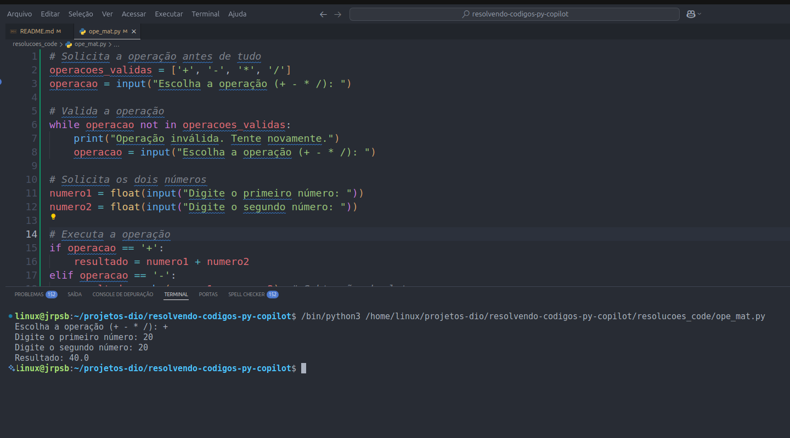

### 📚 O que aprenderemos?

* Operações aritméticas básicas
* Entrada de dados
* Uso de condicionais (`if/elif/else`)
* Boas práticas com validação de entrada

---

## 4 - Verificando Números Pares e Ímpares 🧮

### 📌 Descrição

Receba um número inteiro e verifique se ele é **par** ou **ímpar** usando condicionais.

### 💬 Prompt no ChatGPT


### 🧠 Código Gerado

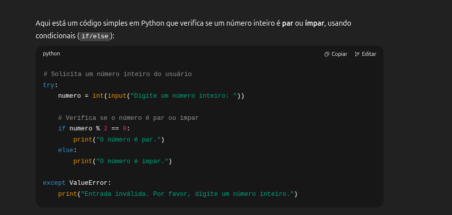

### 🖥️ Terminal com Código Funcionando

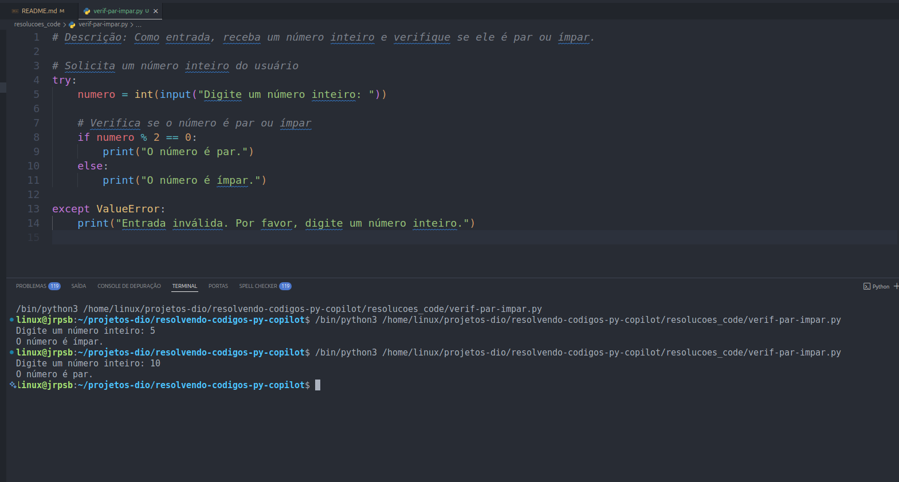

### 📚 O que aprenderemos?

* Condicionais (`if/else`)
* Operador de módulo `%`
* Entrada e verificação de dados

---

## 5 - Calculando Média de Notas 📚

### 📌 Descrição

Calcule a média de **três notas** fornecidas pelo usuário, usando operadores aritméticos.

### 💬 Prompt no ChatGPT


### 🧠 Código Gerado

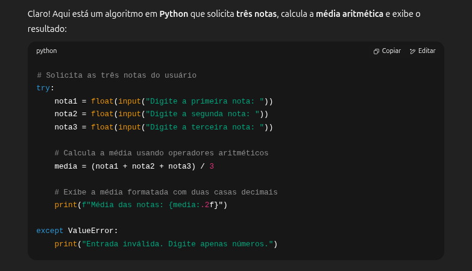

### 🖥️ Terminal com Código Funcionando

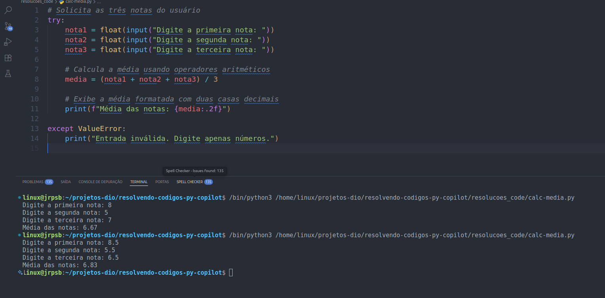

### 📚 O que aprenderemos?

* Leitura de múltiplos valores com `input()`
* Uso de variáveis e média aritmética
* Aplicação de operadores: `+` e `/`

---

## 6 - Verificando Palíndromos 🔄

### 📌 Descrição

Verifique se uma palavra é um **palíndromo**: ou seja, se ela é igual à sua versão invertida.

### 💬 Prompt no ChatGPT


### 🧠 Código Gerado

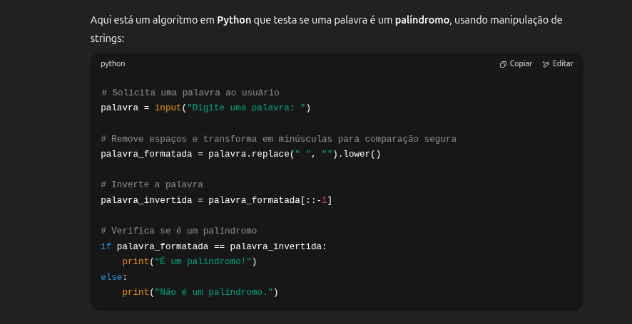

### 🖥️ Terminal com Código Funcionando

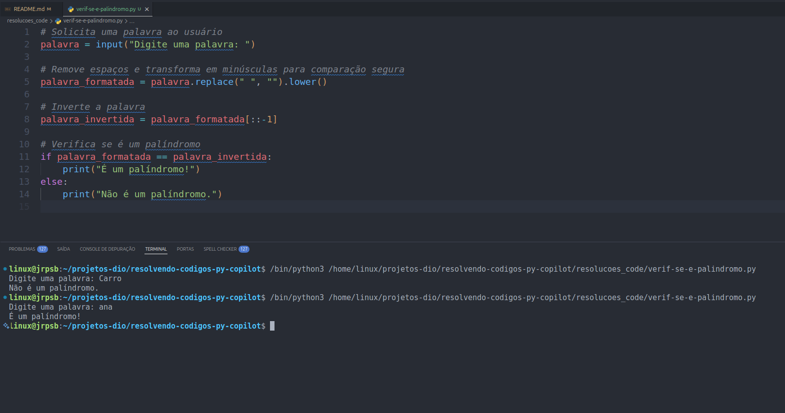

### 📚 O que aprenderemos?

* Manipulação de strings com slicing (`[::-1]`)
* Normalização de texto (`lower()` e `replace()`)
* Comparação lógica
* Aplicação prática do conceito de palíndromo

---

## 📁 Estrutura de Pastas 
```

├── codigos/
│   ├── desafio1_concatenar.py
│   ├── desafio2_repetir.py
│   ├── desafio3_operacoes.py
│   ├── desafio4_par_ou_impar.py
│   ├── desafio5_media.py
│   └── desafio6_palindromo.py
├── imagens/
│   ├── prompt-entrada.png
│   ├── prompt-saida.png
│   ├── resultado.png
│   ├── prompt-entrada1.png
│   └── ...
├── README.md

```
